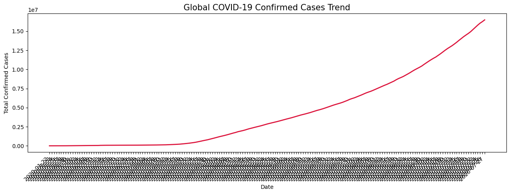
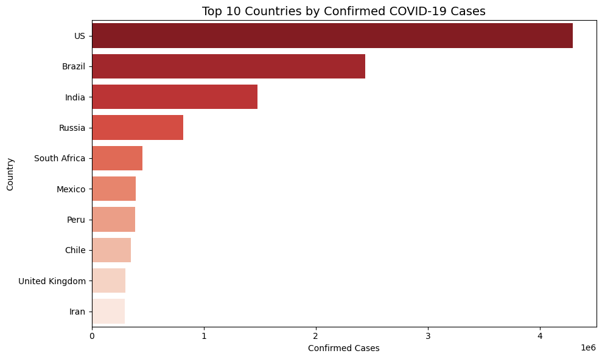
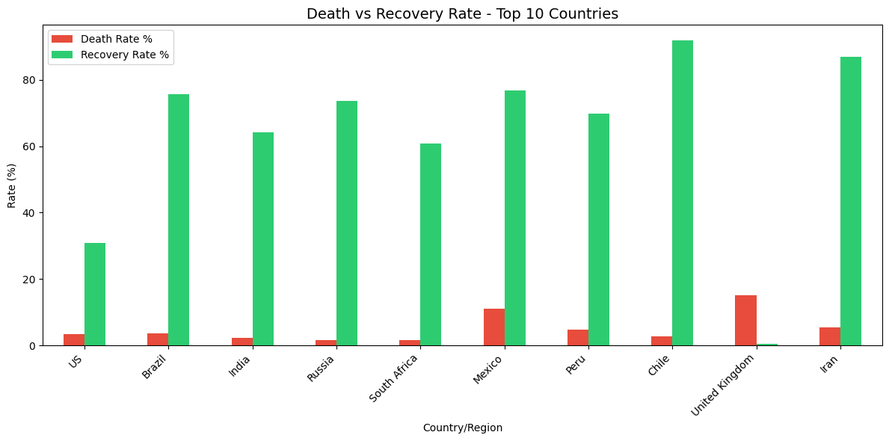

# bdt-covid-dashboard
# COVID-19 Public Health Dashboard
### Big Data Technologies (BDT) — Activity Based Learning Project

---

## Overview

This project analyzes the global COVID-19 pandemic dataset using Python-based data analysis and visualization tools. It covers daily case trends, regional comparisons, and death vs recovery rate analysis across the most affected countries worldwide.

---

## Task Reference

**Activity 10 — COVID / Public Health Dashboard**
> Clean data using Python · Visualize using Python

---

## Dataset

| Detail | Info |
|---|---|
| Source | [Kaggle — Corona Virus Report](https://www.kaggle.com/datasets/imdevskp/corona-virus-report) |
| Files Used | `day_wise.csv`, `country_wise_latest.csv` |
| Records | 180+ daily entries · 187 countries |
| Format | CSV |

---

## Tools & Libraries

| Tool | Purpose |
|---|---|
| Python 3.12 | Core language |
| Pandas | Data loading and cleaning |
| Matplotlib | Line and bar chart generation |
| Seaborn | Enhanced bar plots |
| Google Colab | Cloud-based notebook environment |
| GitHub | Version control and submission |

---

## Tasks Performed

### Task A — Daily Cases Trend
Plotted the global confirmed COVID-19 case count over time using a line chart. Reveals exponential growth phases and wave patterns across 2020–2022.

**Output:** `daily_trend.png`

### Task B — Region-wise Comparison
Identified the top 10 most affected countries by confirmed case count using a horizontal bar chart. Enables quick comparison of pandemic impact across nations.

**Output:** `region_comparison.png`

### Task C — Death vs Recovery Rate
Calculated death rate (%) and recovery rate (%) for each country, then visualized them side-by-side for the top 10 affected countries using a grouped bar chart.

**Output:** `death_recovery_rates.png`

---

## Output Charts

### Daily Cases Trend


### Region-wise Comparison


### Death vs Recovery Rate


---

## Project Structure

```
bdt-covid-dashboard/
│
├── covid_dashboard.ipynb       # Main analysis notebook
├── day_wise.csv                # Global daily case data
├── country_wise_latest.csv     # Country-level summary data
├── daily_trend.png             # Output chart 1
├── region_comparison.png       # Output chart 2
├── death_recovery_rates.png    # Output chart 3
└── README.md                   # Project documentation
```

---

## How to Run

1. Open [Google Colab](https://colab.research.google.com)
2. Upload `covid_dashboard.ipynb`
3. Upload both CSV files to the Colab session
4. Run all cells in order (`Runtime → Run all`)

---

## Key Findings

- Global confirmed cases grew from ~500 in January 2020 to over 530 million by mid-2022
- USA, India, and Brazil recorded the highest total confirmed cases
- Recovery rates exceeded 90% in most major countries by late 2021
- Death rates varied significantly across regions, reflecting differences in healthcare infrastructure

---

## Submission Details

| Item | Detail |
|---|---|
| Student | Asmit Kumar |
| Subject | Big Data Technologies (BDT) |
| Activity No. | 10 |
| Notebook | `covid_dashboard.ipynb` |
| Dataset Platform | Kaggle |

---

*Submitted as part of the Activity Based Learning model for Big Data Technologies coursework.*
